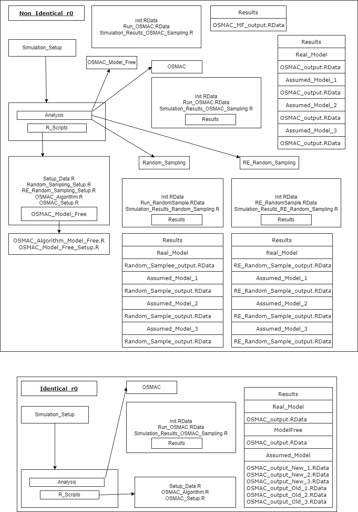
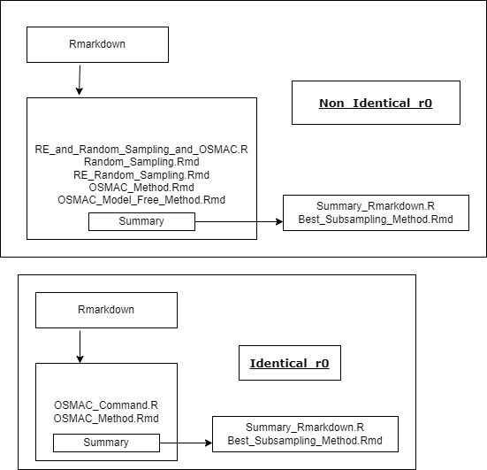
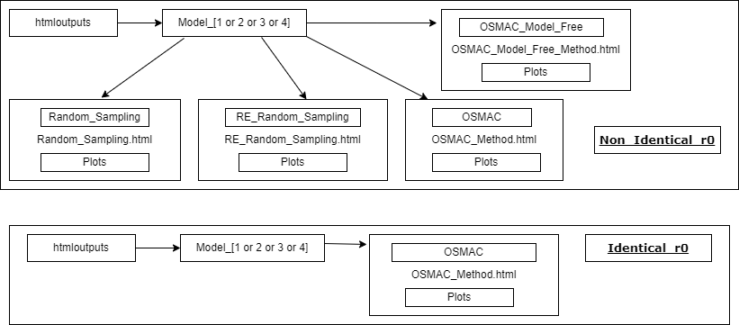
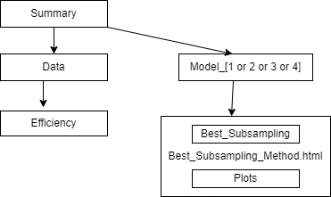

Manual of comparing optimal subsampling with model robust optimal
subsampling method for logistic regression (exponential distribution)
================

# 1. Overview

-   The project ***“Exponential_Distribution”*** or
    ***“RS_OS_MROS_LR_TwoVar_Exponential”*** is developed for the
    purpose of conducting a simulation study such that estimated model
    parameters of the logistic regression model can be compared through
    the obtained informative samples from the Big Data using optimal
    sub-sampling and model robust optimal sub-sampling methods.

-   This document aims to state every important part of this R project
    thoroughly in terms of folder structure related to used sub-sampling
    methods.

# 2. Folder structure

-   The sub-sampling methods applied in this study are

1.  Random Sampling,
2.  Rare event random sampling,
3.  Optimal Sub-sampling (OSMAC), and
4.  Model Robust Optimal Sub-sampling (OSMAC_MF or OSMAC Model Free).

-   A detailed description of all methods are explained in the Figure
    below.

-   Simulations are repeated ***Replicates*** times such that at each
    replicate only ***Subsample_Size*** data points are extracted from
    the Big Data set of ***N*** observations. It is necessary to have
    replications so that we can evaluate the methods through MSE and
    model information of the estimated model parameters.

-   The results from this simulation setup are stored in a such way that
    they could be summarised through Rmarkdown files for individual or
    grouped assessment for the above mentioned methods.

-   In optimal sub-sampling and model robust optimal sub-sampling an
    initial sub-sample of **r0** observations are used to estimate the
    model parameters of a given model. From these parameters only the
    sub-sampling probabilities are calculated. Therefore, to compare
    optimal sub-sampling with model robust optimal sub-sampling there
    are two options; 1). Identical **r0** and 2). Non-Identical **r0**.

-   Hence, **Identical_r0** can be used for method comparison and
    **Non_Identical_r0** can be used for application purposes.

## 2.1 Generated_Big_Data

-   Generate and store Big Data.

-   Based on the real model of the logistic regression data we have four
    folders and in each folder their respective Big Data sets are stored
    by using ***Checking_SP_Model_1\_Exponential_Special.R***.

-   To ensure that the data generated from the true model performs
    better than the assumed models run ***Check_Data.Rmd*** and look at
    the plots stored as \*\*Model\_\[1 or 2 or 3 or 4\]\_X\[1 or
    2\]\*\*.

-   In the Rscript, ***Replicates*** - number of unique simulations,
    ***Subsample_Size*** - target sample size, ***N*** - Big data size,
    ***Theta*** - Real model parameters, ***r0*** - initial sample size
    for optimal and model robust optimal sub-sampling.

-   As of now the model parameters and their respective response
    compositions are

1.  *θ* = \[−2.0,1.5,0.3\] generates data for Model 1 of
    *x*1, *x*2.
2.  *θ* = \[−2.0,1.7,−1.2,0.2\] generates data for Model 2 of
    *x*1, *x*2, *x*12.
3.  *θ* = \[−2.0,−1.3,1.9,0.9\] generates data for Model 3 of
    *x*1, *x*2, *x*22.
4.  *θ* = \[−2.0,1.9,1.9,0.9,0.7\] generates data for Model 4 of
    *x*1, *x*2, *x*12, *x*22.

-   For each model structure covariate data was generated only through
    exponential distribution with no correlation.

## 2.2 Simulation_Setup

-   Contains the simulation setup for the above mentioned subsampling
    methods based on the variety of Big data sets and Rscripts to
    smoothly transfer methods and respective data based on real models.

### 2.2.1 Classical/R_Scripts

We need to transfer two forms of data, 1. Big Data set and other
information essential for the methods. 2. Functions for the sub-sampling
methods.

-   Here we develop the functions and transfer them safely to the
    simulation setup.

#### 2.2.1.1 Setup_Data.R

-   Data stored in **Generate_Big_Data** is transferred to
    **Classical/Analysis**.

#### 2.2.1.2 Random_Sampling_Setup.R

-   A setup for random sampling such that model parameters and model
    information are estimated at each simulation and are applied for the
    generated big data.

#### 2.2.1.3 RE Random_Sampling_Setup.R

-   A setup for rare event random sampling such that model parameters
    and model information are estimated at each simulation and are
    applied for the generated big data.

#### 2.2.1.4 OSMAC_Algorithm.R and OSMAC_Setup.R \[Identical r0\]

-   The optimal sub-sampling, model robust optimal sub-sampling and a
    setup to apply these methods such that model parameters and model
    information are estimated at each simulation and are applied for the
    generated big data.

#### 2.2.1.4 OSMAC_Algorithm.R and OSMAC_Setup.R \[Non Identical r0\]

-   The optimal sub-sampling and a setup to apply these methods such
    that model parameters and model information are estimated at each
    simulation and are applied for the generated big data.

#### 2.2.1.6 OSMAC_Algorithm_Model_Free.R and OSMAC_Model_Free_Setup.R \[Non_Identical_r0\]

-   The model robust optimal sub-sampling and a setup to apply these
    methods such that model parameters and model information are
    estimated at each simulation and are applied for the generated big
    data.

## 2.2.2 Classical/Analysis

Each model related covariate data is separately used on each subsampling
method individually.

#### 2.2.2.1 Random Sampling

-   **Init.RData** - data file containing the generated big data and
    initial information regarding the simulation.
-   **Run_RandomSample.RData** - Random sampling function for
    **Replicates**.
-   **Simulation_Results_Random_Sampling.R** - R script to run the
    random sampling method over **Replicates** on the **Init.RData**
    from **Run_RandomSample.RData**.
-   **Results** - Results of the simulation are stored here according to
    real and assumed models, in each folder a single Rdata file
    **Random_Sample_output.RData** is stored.

#### 2.2.2.2 RE Random Sampling

-   **Init.RData** - data file containing the generated big data and
    initial information regarding the simulation.
-   **RE_RandomSample.RData** - RE Random sampling function for
    **Replicates**.
-   **Simulation_Results_RE_Random_Sampling.R** - R script to run the
    rare event random sampling method over **Replicates** on the
    **Init.RData** from **RE_RandomSample.RData**.
-   **Results** - Results of the simulation are stored here according to
    real and assumed models, in each folder a single Rdata file
    **RE_Random_Sample_output.RData** is stored.

#### 2.2.2.3 OSMAC \[Non Identical r0\]

-   **Init.RData** - data file containing the generated big data and
    initial information regarding the simulation.
-   **Run_OSMAC.RData** - Optimal sampling function for **Replicates**.
-   **Simulation_Results_OSMAC_Sampling.R** - R script to run the
    optimal sampling method over **Replicates** on the **Init.RData**
    from **Run_OSMAC.RData**.
-   **Results** - Results of the simulation are stored here according to
    real and assumed models, in each folder a single Rdata file
    **OSMAC_output.RData** is stored.

#### 2.2.2.4 OSMAC Model Free \[Non Identical r0\]

-   **Init.RData** - data file containing the generated big data and
    initial information regarding the simulation.
-   **Run_OSMAC.RData** - model robust optimal sampling function for
    **Replicates**.
-   **Simulation_Results_OSMAC_Sampling.R** - R script to run the model
    robust optimal sampling method over **Replicates** on the
    **Init.RData** from **Run_OSMAC.RData**.
-   **Results** - Results of the simulation are stored here as a single
    Rdata file **OSMAC_MF_output.RData**.

#### 2.2.2.5 OSMAC \[Identical r0\]

-   **Init.RData** - data file containing the generated big data and
    initial information regarding the simulation.
-   **Run_OSMAC.RData** - optimal sampling and model robust optimal
    sampling function for **Replicates**.
-   **Simulation_Results_OSMAC_Sampling.R** - R script to run the
    optimal sampling and model robust optimal sampling methods over
    **Replicates** on the **Init.RData** from **Run_OSMAC.RData**.
-   **Results** - Results of the simulation are stored here according to
    real models, assumed models and model robust (free) methods in each
    folder as Rdata files **OSMAC_output.RData**.

## 2.3 Outputs

-   While in the **Simulation_Setup** results are stored for analysis
    purposes, the same results are stored here.

## 2.4 Rmarkdown

-   Rmarkdown files are used to individually assess the sub-sampling
    methods through plots for estimated model parameters, variance and
    bias.

-   **RE_and_Random_Sampling_and_OSMAC.R** - R script to summarise the
    results from the sub-sampling methods through the Rmarkdown files
    **Random_Sampling.Rmd**, **RE_Random_Sampling.Rmd**,
    **OSMAC_Method.Rmd** and **OSMAC_Model_Free_Method.Rmd**.

-   **OSMAC_Command.R** - R script to summarise the results from the
    optimal sub-sampling and model robust optimal sampling methods
    through the Rmarkdown file **OSMAC_Method.Rmd**.

-   **Summary_Rmarkdown.R** in the **Rmarkdown/Classical/Summary**
    folder compares the sub-sampling methods through Mean Squared Error,
    variance and model information through the
    **Best_Subsampling_Method.Rmd**.

## 2.5 htmloutputs

-   Here, summaries from the Rmarkdown files **Random_Sampling.Rmd**,
    **RE_Random_Sampling.Rmd**, **OSMAC_Method.Rmd**(for Identical and
    Non Identical r0) and **OSMAC_Model_Free_Method.Rmd** (for Non
    Identical r0) are stored as html files.

## 2.6 Summary

-   Here, summaries from the Rmarkdown files
    **Best_Subsampling_Method.Rmd** are stored as html files.

### 2.6.1 Summary/Classical/Model\_\[1 or 2 or 3 or 4\]/Data/Efficiency

-   When running the Rmarkdown files **Random_Sampling.Rmd**,
    **RE_Random_Sampling.Rmd**, **OSMAC_Method.Rmd** and
    **OSMAC_Model_Free_Method.Rmd** summary data (MSE and model
    information) are stored here.

-   Using these data files only summarising through the files in
    **Rmarkdown/Classical/Summary** occurs.

## 2.7 Articles.Rmd, Publication.Rmd and Publication_Ready_Command.R

-   Use **Publication_Ready_command.R** to run **Publication.Rmd** on
    every model and its respective big data.

-   Use **Articles.Rmd** to generate plots relevant to the paper as pdf
    files **SMSE_MI_LR_TV_Exp_mMSE.pdf** and
    **SMSE_MI_LR_TV_Exp_mVc.pdf**.
